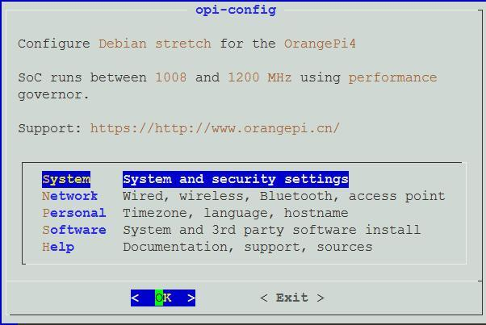

# Use opi-config to Configure system

Execute the command at terminal

```bash
opi-config
```



Install it as follows if this command is not available

```bash
apt-get install -y dialog expect bc cpufrequtils figlet toilet lsb-release
git clone https://github.com/baiywt/opi_config_libs.git
cp opi_config_libs /usr/local/sbin/ -rfa
cp opi_config_libs/opi-config /usr/local/sbin -f
rm -rf /etc/update-motd.d/*
cp opi_config_libs/overlay/* / -rfa
```