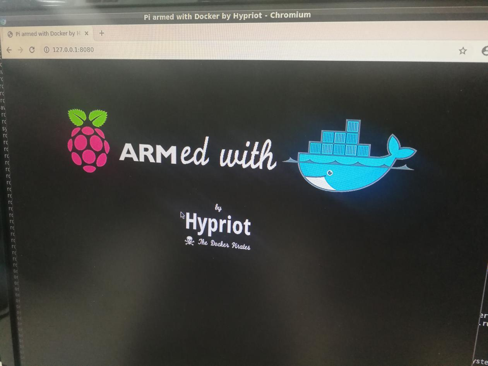

# Use Docker on orangepi 4

## 1. Download the installation package

```bash
wget
https://download.docker.com/linux/ubuntu/dists/bionic/pool/stable/arm
64/containerd.io_1.2.6-3_arm64.deb
wget
https://download.docker.com/linux/ubuntu/dists/bionic/pool/stable/arm
64/docker-ce-cli_19.03.2~3-0~ubuntu-bionic_arm64.deb
wget
https://download.docker.com/linux/ubuntu/dists/bionic/pool/stable/arm
64/docker-ce_19.03.2~3-0~ubuntu-bionic_arm64.deb
```

## 2. Install docker

```bash
sudo dpkg -i *.deb
```

## 3. Use Docker

(1)Run directly

Execute command on terminal

```bash
sudo docker run hello-world
```

The following message appears

```bash
Unable to find image 'hello-world:latest' locally
latest: Pulling from library/hello-world
be6e184261a6: Pull complete
Digest:
sha256:4fe721ccc2e8dc7362278a29dc660d833570ec2682f4e4194f4ee23e415e10
64
Status: Downloaded newer image for hello-world:latest
Hello from Docker!
This message shows that your installation appears to be working correctly.
```

Directly execute the following command to enter ubuntu docker

```bash
root@OrangePi:~# docker run -it ubuntu bash

0;root@0a8c24c3c7de: /root@0a8c24c3c7de:/# ls

bin dev home media opt boot etc lib  mnt
root sbin sys usr proc run srv tmp var
```

(2)Search for available images that support arm64v8 format and execute, Run docker search arm64v8 to find arm64v8/nginx , Then you can run docker run -it arm64v8/nginx bash

(3)Searched for an image that does not support the format, rebuild it into arm64 format and run it again For example, after executing docker search ubuntu to find eclipse/ubuntu_jdk8 . If you directly execute docker run -it eclipse/ubuntu_jdk8 bash, it will report the wrong format. Create a docker directory locally, and then create the following two files called Dockfile and sources.list into the file

```bash
Dockerfile:
FROM armhf/debian
COPY ./sources.list /etc/apt/sources.list
RUN apt-get update
RUN echo "root:fa" | chpasswd
USER root
RUN echo "all done."
sources.list:
deb [arch=armhf] http://ftp2.cn.debian.org/debian/ jessie main
contrib non-free
deb-src [arch=armhf] http://ftp2.cn.debian.org/debian/ jessie main
contrib non-free
#
deb
[arch=armhf]
http://ftp2.cn.debian.org/debian/
jessie-updates main contrib non-free
#
deb-src
[arch=armhf]
http://ftp2.cn.debian.org/debian/
jessie-updates main contrib non-free
```

Then execute the docker build -t "eclipse/ubuntu_jdk8" docker
command and then execute docker run -it eclipse/ubuntu_jdk8 bash to
run


(4)Docker image using raspberry pi At the following URL https://hub.docker.com/u/hypriot/ you can find a lot of docker images that support Raspberry pi such as rpi-busybox-httpd, these Orangepi 4 are also supported After executing the command,

```bash
docker run -d -p 8080:80 hypriot/rpi-busybox-httpd
0cbdce32ec6c639e55b6a8d8e09c030e7c1acc994dd02308af51fa8be9d041e5
```
You can access the server page through the browser 127.0.0.1:8080 as
follows

