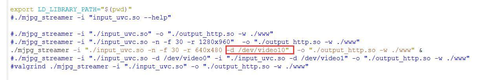
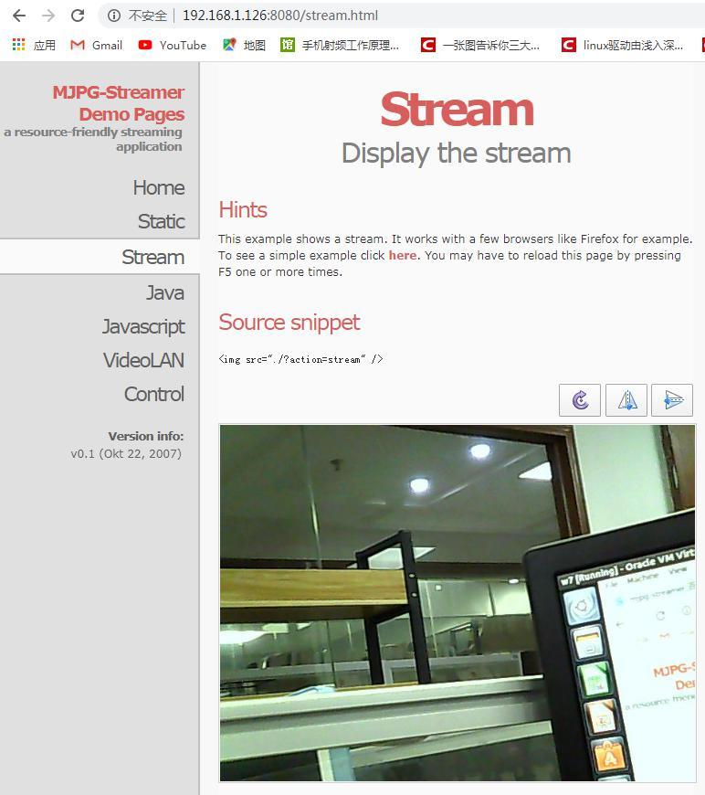

# mjpg-streamer network video streaming server

```bash
git clone https://github.com/jacksonliam/mjpg-streamer
sudo apt-get install cmake libjpeg8-dev
sudo apt-get install gcc g++
cd mjpg-streamer-experimental
make
sudo make install
```

Start.sh has an example of use. Insert the uvc camera on Pi4, and the corresponding
device node should be video10.
Make the following modifications.



Execute start.sh .With following information

```bash
root@OrangePi:~/mjpg-streamer/mjpg-streamer-experimental# ./start.sh
root@OrangePi:~/mjpg-streamer/mjpg-streamer-experimental#
MJPG Streamer Version: git rev:
501f6362c5afddcfb41055f97ae484252c85c912
i: Using V4L2 device.: /dev/video10
i: Desired Resolution: 640 x 480
i: Frames Per Second.: 30
i: Format............: JPEG
i: TV-Norm...........: DEFAULT
i: Could not obtain the requested pixelformat: MJPG , driver gave us:
YUYV
... will try to handle this by checking against supported formats.
... Falling back to YUV mode (consider using -yuv option). Note that
this requires much more CPU power
o: www-folder-path......: ./www/
o: HTTP TCP port........: 8080
o: HTTP Listen Address..: (null)
o: username:password....: disabled
o: commands.............: enabled
```

Input board IP address and port number at browser.如 192.168.1.126:8080



System environment:OrangePi_4_ubuntu_bionic_desktop_linux4.4.179_v1.2.img
Hardware environment:V1.3