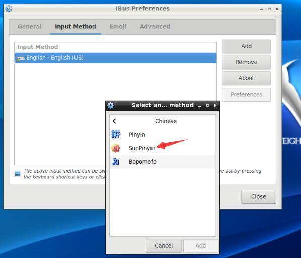
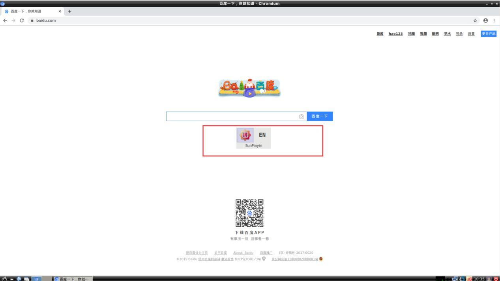

# Install Chinese input methods

Pi4 ubuntu18.04 install Chinese input methods
Text the image:OrangePi_4_ubuntu_bionic_desktop_linux4.4.179_v1.1.img

## 1. Install the input framework of ibus

Execute the following command at terminal

```bash
apt-get install ibus ibus-clutter ibus-gtk ibus-gtk3 ibus-qt4
```

## 2. Install ibus-pinyin

Execute the following command at terminal

```bash
apt-get install ibus-pinyin ibus-sunpinyin
```

## 3. Configure the input methods

Click the icon at the bottom left,choose IBus Preferences


Select in the pop-up window


Select ok


The configuration page pops-up


Select Vertical for the input methods direction


Click the button below to select the shortcut


Tick Control in the pop-up window, remove the check mark in front of Super, and
then click Apply. Then click ok.


Go back to the previous window and click Input Method.


There is only English language as shown below, click “add Chinese input method”.


Select Chinese


Select Sunpinyin,click Add



The SunPinyin input method added successfully.


Open a browser


Hold down the Ctrl key and press the space key to switch to the SunPinyin input method


