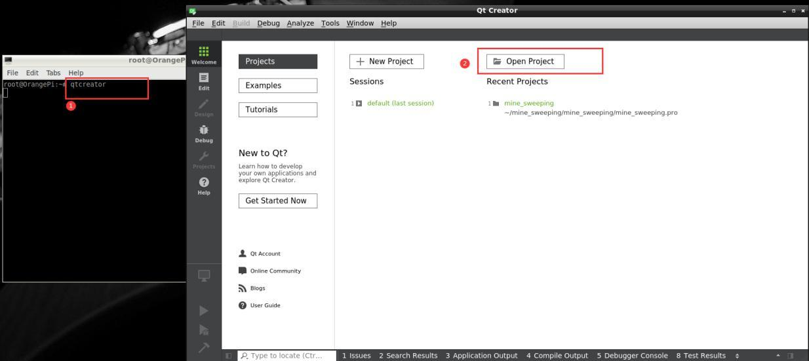
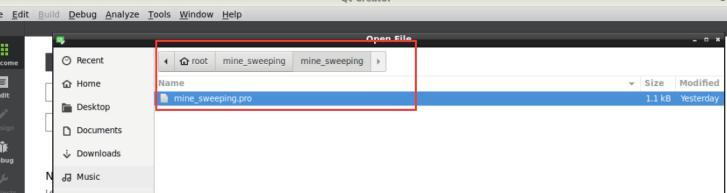
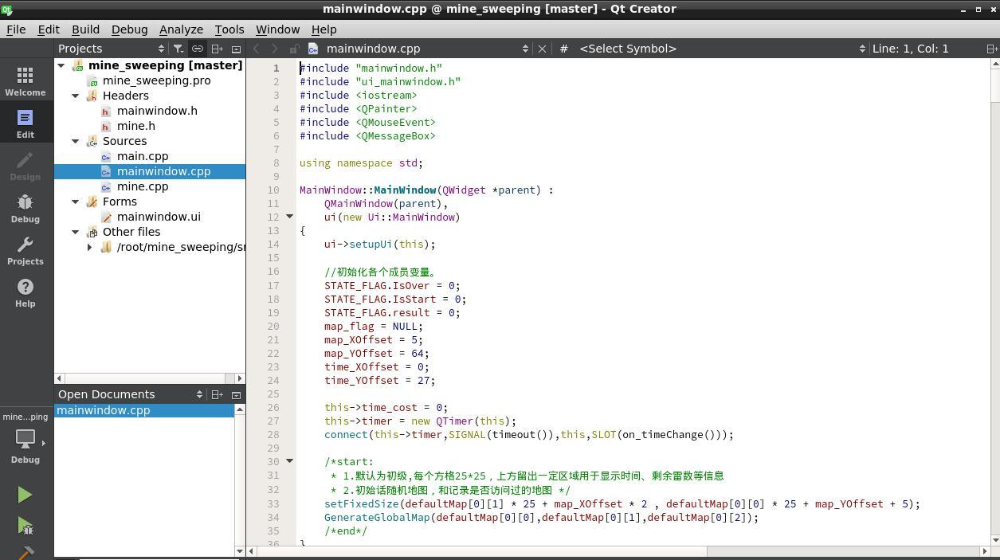
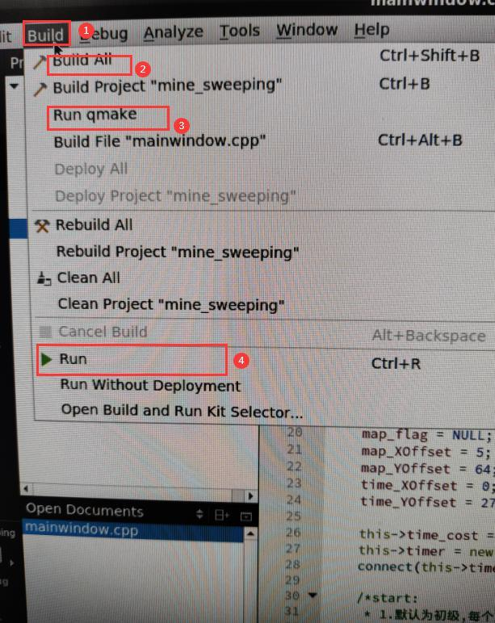

# Install QT and it’s using examples

## 1.Install QT5

```bash
sudo apt-get update
sudo apt-get install qt5-default
sudo apt-get install qtcreator
```

Check installation

```bash
orangepi@orangepi:~$ qmake -v
QMake version 3.1
Using Qt version 5.9.5 in /usr/lib/aarch64-linux-gnu
```

## 2. QT usage example: minesweeper

```bash
git clone https://github.com/qmeng0207/mine_sweeping
```

Open qtcreator through Terminal
As shown below:



Click Open Project and select the minesweeper source just git clone



Build and run this source code can play minesweeper


