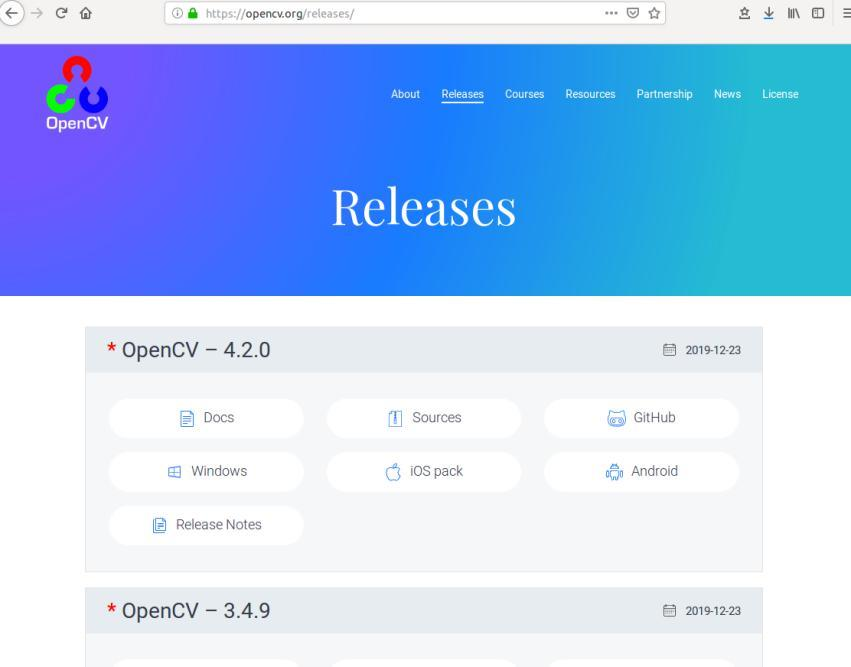

# Integrated OpenCV

## 1. OpenCV Introduction

OpenCV is a popular open source computer vision library, which provides many
functions and implements many computer vision algorithms, ranging from the most
basic filtering to advanced object detection. The design goal of OpenCV is to execute
as fast as possible, focusing on real-time applications. It is written in optimized
C/C++ code and can take full advantage of multi-core processors. Its main goal is to
build a simple and easy-to-use computer vision framework to help Developers can
more easily design more complex computer vision related applications.

OpenCV was founded by Intel in 1999 and is now supported by Willow Garage. It is a
cross-platform computer vision library based on open source distribution, which can
run on Linux, Windows, Mac OS, Android, iOS, Maemo, FreeBSD, OpenBSD and
other operating systems.

OpenCV can be used to solve problems in the following areas:
Human-computer interaction, object recognition, image partitioning, face recognition,
motion recognition, motion tracking

## 2. Install OpenCV

### 1. First install the necessary software and dependent libraries, etc.

```bash
sudo apt-get update
sudo apt-get install cmake git

sudo apt-get install cmake qt5-default libvtk6-dev zlib1g-dev
libjpeg-dev libwebp-dev libpng-dev libtiff5-dev libopenexr-dev
libgdal-dev libdc1394-22-dev libavcodec-dev libavformat-dev
libswscale-dev libtheora-dev libvorbis-dev libxvidcore-dev libx264-dev
yasm libopencore-amrnb-dev libopencore-amrwb-dev
```

### 2 Download the OpenCV source code

On the OpenCV official website https://opencv.org/releases/ select the version and
download method you need to download。




The version used here is OpenCV–4.2.0.

### 3. compile

```bash
cd opencv-4.2.0
mkdir build
cd build
cmake -D CMAKE_BUILD_TYPE=RELEASE -D \
CMAKE_INSTALL_PREFIX=/usr/local/opencv ..
make -j4
make install
ldconfig
```

Simple test example

```bash
import cv2 as cv
img = cv.imread("/usr/share/lxde/wallpapers/orangepi.jpg")
cv.namedWindow("Image")
cv.imshow("Image", img)
cv.waitKey(0)
cv.destroyAllWindows()
```