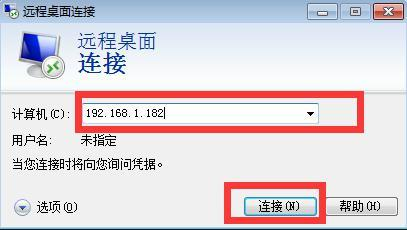
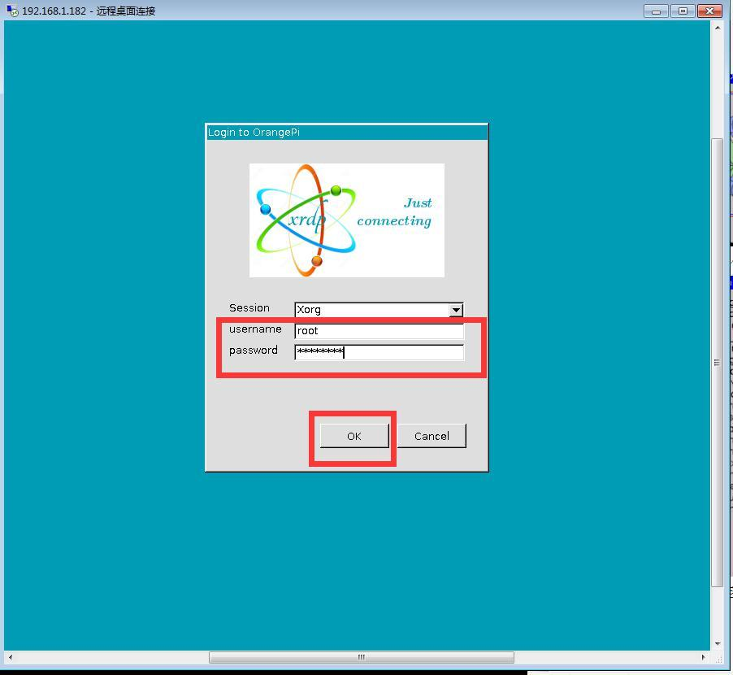
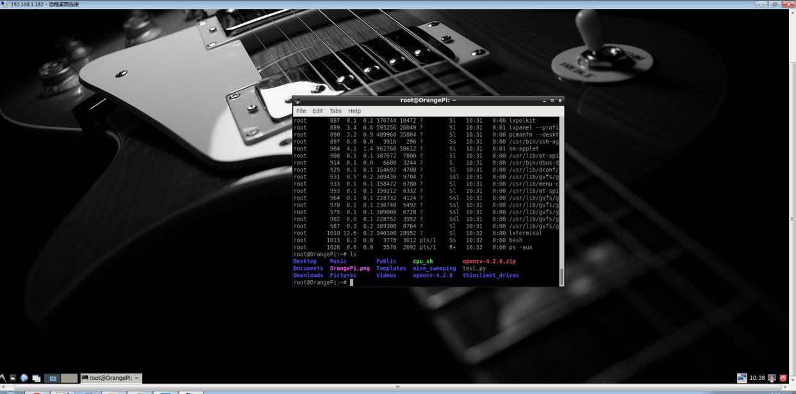

# Integrated XRDP remote desktop

## 1、Install XRDP Remote Desktop

```bash
sudo apt-get install xrdp
sudo apt-get install vnc4server tightvncserver
```

## 2、Start xrdp

```bash
/etc/init.d/xrdp start
```

1、Need to set a password

2、Open the remote desktop software on windows



3、Click to Connect

4、Enter the user and password, click "OK", it will be connected, and it will directly
enter the Pi4 desktop。


