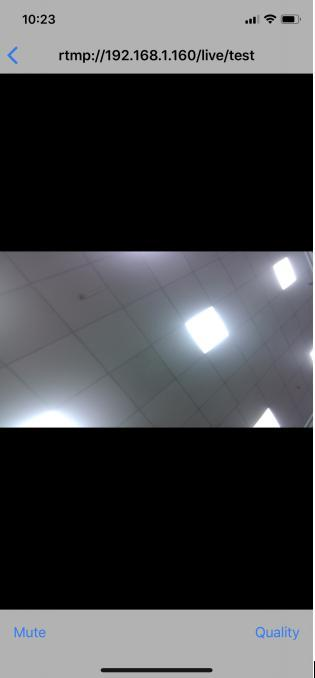
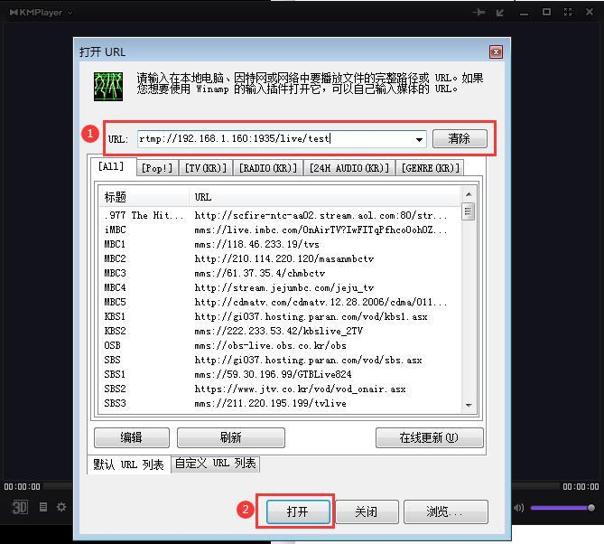
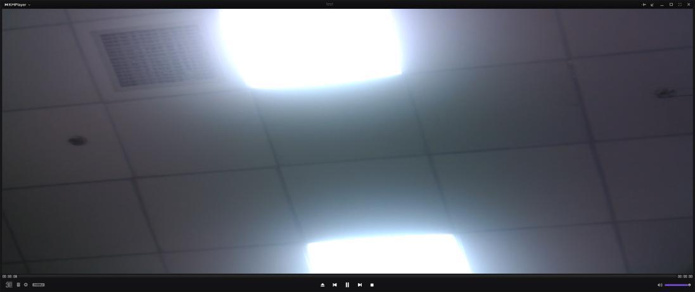

# Use the camera + development board to realize video streaming

This chapter introduces the Pi4 RK3399 linux platform, using the camera to collect real-time video data stream, push it to the RTMP listening server, and use the client to access the RMTP server to watch the video.

System version: Ubuntu 18.04.1 LTS (GNU/Linux 4.4.179-gb623ef72-dirty aarch64)

desktop version

Mirror: OrangePi_4_ubuntu_bionic_desktop_linux4.4.179_v1.2.img

One ov13850 camera is required, which can be purchased from orangepi .

## 1、Build RTMP live streaming server

Install nginx and nginx-rtmp-module modules on the development board as RTMP
server, execute the following commands in sequence:

```bash
root@OrangePi:~#
root@OrangePi:~#
root@OrangePi:~#
root@OrangePi:~#
root@OrangePi:~#
apt-get update
apt-get -y install nginx
apt-get -y remove nginx
apt-get clean
rm -fr /etc/nginx/*
root@OrangePi:~# apt-get install -y curl build-essential libpcre3
libpcre3-dev libpcre++-dev zlib1g-dev libcurl4-openssl-dev libssl-dev
```

```bash
root@OrangePi:~# mkdir -p /var/www
root@OrangePi:~# rm -fr nginx_src
root@OrangePi:~# mkdir -p nginx_src
root@OrangePi:~# cd nginx_src/
root@OrangePi:~/nginx_src# ls
root@OrangePi:~/nginx_src# NGINXSRC=$PWD
```

```bash
root@OrangePi:~/nginx_src# wget
http://nginx.org/download/nginx-1.13.8.tar.gz
root@OrangePi:~/nginx_src# git clone
https://github.com/arut/nginx-rtmp-module.git
```

```bash
cd nginx-rtmp-module/
git checkout -b ng1.13.8 791b6136f02bc9613daf178723ac09f4df5a3bbf
```

```bash
root@OrangePi:~/nginx_src# tar -xvf nginx-1.13.8.tar.gz
root@OrangePi:~/nginx_src# cd nginx-1.13.8/
```

```bash
./configure --prefix=/var/www --sbin-path=/usr/sbin/nginx
--conf-path=/etc/nginx/nginx.conf --pid-path=/var/run/nginx.pid
--error-log-path=/var/log/nginx/error.log
--http-log-path=/var/log/nginx/access.log --with-http_ssl_module
--without-http_proxy_module --add-module=$NGINXSRC/nginx-rtmp-module
```

```bash
Compile nginx
root@OrangePi:~/nginx_src/nginx-1.13.8# make
root@OrangePi:~/nginx_src/nginx-1.13.8# make install
```

View version information:

```bash
root@OrangePi:~/nginx_src/nginx-1.13.8# nginx -v
nginx version: nginx/1.13.8
```

## 2、Configure RTMP server

Edit nginx configuration file:

```bash
root@OrangePi:~# vim /etc/nginx/nginx.conf
```

Add the following RTMP configuration at the end:

```bash
rtmp {
    server {
        listen 1935;
        chunk_size 4096;
        application live {
            live on;
            record off;
        }
    }
}
```

Restart the nginx service for the configuration to take effect:

```bash
root@OrangePi:~# systemctl restart nginx
```

## 3、Verify RTMP server

Use test video to determine if the RMTP server is working:

```bash
root@OrangePi:~# gst-launch-1.0 videotestsrc is-live=true !
videoconvert ! x264enc bitrate=1000 tune=zerolatency ! video/x-h264 !
h264parse ! video/x-h264 ! queue ! flvmux streamable=true name=mux !
rtmpsink sync=false location='rtmp://192.168.1.160:1935/live/test'
```

Note: You need to change the above IP to your actual IP。

The following message appears。

```bash
Setting pipeline to PAUSED ...
Pipeline is live and does not need PREROLL ...
Setting pipeline to PLAYING ...
New clock: GstSystemClock
Redistribute latency...
```

Then under the Ubuntu system of the host PC, use rtmpdump test to pull the video stream from Pi4:

1 install rtmpdump:

Install dependencies:

```bash
sudo apt-get install openssl
sudo apt-get install libssl-dev
sudo apt-get install zlib1g-dev
```
Download the rtmpdump source code and compile and install it:

```bash
git clone git://git.ffmpeg.org/rtmpdump
cd rtmpdump/
make
sudo make install
sudo ldconfig
ldd rtmpdump
```

2 Test with rtmpdump:

```bash
rtmpdump -r "rtmp://192.168.1.160/live/test" -V -z -o out.flv
```

Press Crtl+C to pause the collection, view the generated out.flv file, it can be played normally, indicating that the RTMP server is working normally:

```bash
dale@dale:~/dale/share/Drivers-package/rtmpdump$ ls -lh out.flv
-rw-rw-r-- 1 dale dale 652K 1 月 2 18:05 out.flv
```

## 4、Push OV13850 camera image to RTMP server

```bash
root@OrangePi:~# gst-launch-1.0 rkisp io-mode=1 device=/dev/video1 !
video/x-raw,format=NV12,width=1280,height=720,framerate=30/1 ! queue !
mpph264enc ! h264parse ! flvmux streamable=true ! queue ! rtmpsink
sync=false location='rtmp://192.168.1.160:1935/live/test'
```
Note: Change the above IP address to your own。

```bash
Setting pipeline to PAUSED ...
mpi: mpp version: Without VCS info
mpp_rt: NOT found ion allocator
mpp_rt: found drm allocator
media get entity by name: lens is null
Pipeline is live and does not need PREROLL ...
[XCORE]:XCAM ERROR rkisp_device.cpp:72: atomisp device(/dev/video1) try subdev
format failed
Setting pipeline to PLAYING ...
New clock: GstSystemClock
h264e_api: h264e_config MPP_ENC_SET_RC_CFG bps 3456000 [3240000 : 3672000]
```

## 5、Play video stream

1 Play on phone

If the mobile phone is iPhone, install a free software of SLDP Player, add the streaming address rtmp://192.168.1.160/live/test to view the live image:



2 Play through the page

Create a play page to achieve the purpose of browsing the live broadcast screen by opening the URL http://development board IP address with a browser. The following are the creation steps:

```bash
root@OrangePi:~# mkdir -p strobe_src
root@OrangePi:~# cd strobe_src/
root@OrangePi:~/strobe_src# wget
http://downloads.sourceforge.net/project/smp.adobe/Strobe%20Media%20P
layback%201.6%20Release%20%28source%20and%20binaries%29/StrobeMediaPl
ayback_1.6.328-full.zip
root@OrangePi:~/strobe_src# unzip StrobeMediaPlayback_1.6.328-full.zip
root@OrangePi:~/strobe_src# cp -r for\ Flash\ Player\ 10.1
/var/www/html/strobe
```

Edit /var/www/html/index.html, fill in the following content, remember to replace the following "development board IP address" with your actual IP address, the IP address can be viewed through the ifconfig command:

```bash
root@OrangePi:/var/www/html# cat index.html
<!DOCTYPE html PUBLIC "-//W3C//DTD XHTML 1.0 Strict//EN"
"http://www.w3.org/TR/xhtml1/DTD/xhtml1-strict.dtd”>
<html xmlns="http://www.w3.org/1999/xhtml">
<head>
<title>OrangePi Live</title>
<script type="text/javascript"
src="strobe/lib/swfobject.js"></script>
<script type="text/javascript">
// Create a StrobeMediaPlayback configuration
var parameters = {
// src:
"http://players.edgesuite.net/videos/big_buck_bunny/bbb_448x252.mp4",
src: "rtmp://192.168.1.160/live/test",
autoPlay: true,
controlBarAutoHide: false,
playButtonOverlay: true,
showVideoInfoOverlayOnStartUp: false,
optimizeBuffering : false,
initialBufferTime : 0.1,
expandedBufferTime : 0.1,
minContinuousPlayback : 0.1,
poster: "strobe/images/poster.png"
};
// Embed the player SWF:
swfobject.embedSWF
( "strobe/StrobeMediaPlayback.swf"
, "strobeMediaPlayback"
, 640
, 480
, "10.1.0"
, {}
, parameters
, { allowFullScreen: "true"}
, { name: "strobeMediaPlayback" }
);
</script>
</head>
<body>
<div id="strobeMediaPlayback">
<p>Alternative content</p>
</div>
</body>
</html>
```

Finally, use a browser to open the URL http://development board IP address on the computer to enter the playback interface

3 Play with Kmplayer Plus software in Windows

Install Kmplayer Plus software in Windows, open the software and add the stream address, you can view the live image.

Open Kmplayer Plus and press Ctrl+u to add the stream address in the URL address bar: rtmp://192.168.1.160:1935/live/test, and then click "Open" to display the live broadcast screen:


